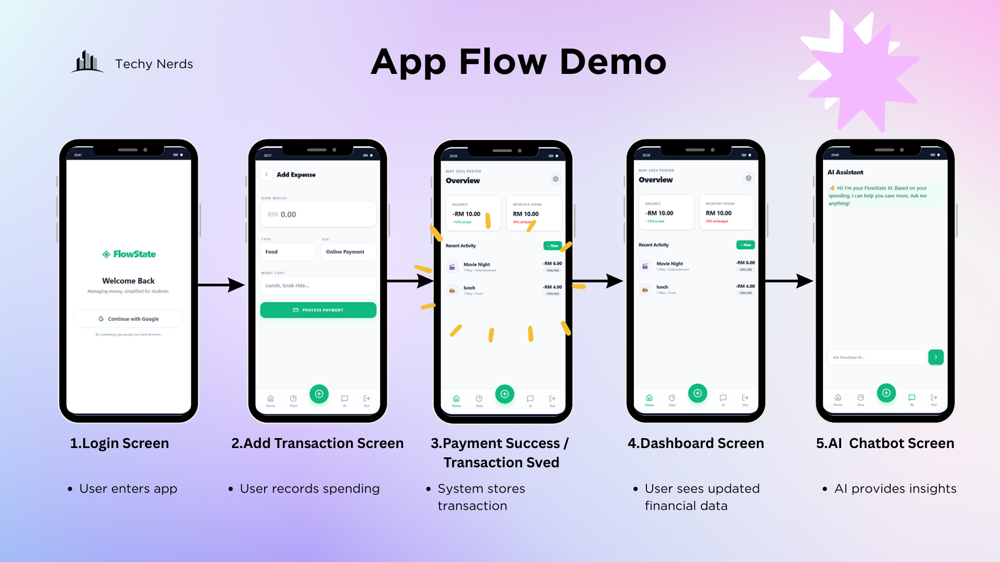

# FlowState

> "Track smarter. Spend wiser" — Managing money, simplified for students.

FlowState is an AI-powered financial tracking assistant designed specifically to help students build better financial habits. This project was built for the **Build With AI Hackathon 2026** by team **Techy Nerds**.

---

## ⚠️ The Problem

Students often struggle with managing their finances due to:
* Overspending without realizing it.
* Poor budgeting habits and no clear understanding of spending patterns.
* Complex financial apps that are not student-friendly and lack personalized guidance.

Poor financial habits can lead to unnecessary debt, lack of savings, and severe financial stress.

---

## 💡 Our Solution

Our goal is to make financial tracking simple and provide AI-powered financial guidance to help users build better habits.

### Key Features
* **Expense Tracking & Payment Recording:** Easily log your daily expenses.
* **Spending Analytics:** Get a clear overview of where your money goes.
* **AI Financial Assistant:** Powered by the Gemini API, our chatbot acts as a personal financial advisor.
* **Smart Spending Insights:** The AI analyzes spending habits, detects overspending categories, and suggests actionable budgeting strategies.

---

## 🛠️ System Architecture & Tech Stack

FlowState is built using a modern, scalable tech stack:

* **Frontend:** Flutter
* **Backend & Database:** Firebase Backend, Firebase Database, and Cloud Functions
* **Authentication:** Firebase Authentication
* **AI Integration:** Gemini API

**Data Flow:** `Flutter App` ➔ `Firebase Backend` ➔ `Firebase Database` ➔ `Gemini API`

---

## 📱 App Flow

  

---

## 🚀 Future Enhancements

We plan to expand FlowState with the following features:
* Real payment gateway integration
* Open banking API support
* Smart budget prediction
* Receipt scanning with AI
* Spending anomaly detection
* Multi-language support

---

## 👨‍💻 Team: Techy Nerds
* Rugen
* Ruben
* Linga
* Harrish
